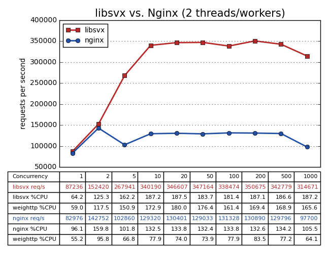

Main Page {#mainpage}
=========

Overview
--------

libsvx (service X library) is a pure C network library. It only supports
Linux, but it depend on very few libraries (only libc and libpthread).

libsvx use reactor pattern. It provides a mechanism to execute a callback
function when a specific event occurs on a file descriptor or after a
timeout has been reached. Based on this mechanism, libsvx provides several
basic network module, they are: TCP server module, TCP client module,
UDP module and ICMP module. libsvx do *NOT* provides application layer
network module like: HTTP server, HTTP client, DNS client, etc.

libsvx use the thread mode called: one I/O looper pre thread, with optional
thread pool.

Feature
-------

* supports IPv4 and IPv6
* supports epoll, poll and select
* TCP server module
* TCP client module
* UDP module (unicast and multicast)
* ICMP module (ICMPv4 and ICMPv6)
* asynchronous log module
* crash log module
* thread pool module
* process helper module (watchdog, daemon, singleton, user/group, signal, ...)
* use BSD queue(3) and tree(3) data structure

Benchmark
---------

Here is a performance benchmark testing that libsvx vs. Nginx. We wrote a
very simple HTTP server (benchmarks/httpserver/main.c) using libsvx for test.
We use weighttp(https://github.com/lighttpd/weighttp) as the benchmarking tool,
and use matplotlib(http://matplotlib.org/) to create a image from test results.
libsvx/nginx and weighttp run in the same machine.

* Hardware: Intel Core i5-3470 @ 3.20GHz (Quad-core), 8GB RAM, 1000mbps Ethernet

* OS: Debian 8 (Linux kernel 3.16)

* libsvx: a very simple HTTP server (benchmarks/httpserver/main.c) using libsvx 0.0.1

* Nginx version: 1.9.6

* Nginx conf:

        ......
        worker_processes 1; #2;
        worker_rlimit_nofile 10240;
	    events {
	        worker_connections  10240;
        }
	    http {
	        ......
            keepalive_timeout  65;
            keepalive_requests 10000;
            server {
		        ......
                listen 80;
                location /hello {
			        default_type text/plain;
				    return 200 'hello world!';
			    }
		    }
	    }
		......

* Weighttp version: 0.3

* Weighttp command:

        weighttp -k -n 100000 -c [1|2|5| ... |1000] -t [1|2] http://127.0.0.1:port/hello

* Automated test script: benchmarks/httpserver/test.py

Clone and Download
------------------

    git clone https://github.com/caikelun/libsvx.git
	wget https://github.com/caikelun/libsvx/archive/master.zip

Build, Test and Clean
---------------------

    Configure            : ./configure
    Build library        : make [strip] [BUILD=debug|release] [COVERAGE=yes|no] [GPROF=yes|no]
    Build test app       : make test [BUILD=debug|release] [COVERAGE=yes|no] [GPROF=yes|no]
    ^ Run test app       : sudo ./test/test
    Build benchmark apps : make benchmarks [BUILD=debug|release] [COVERAGE=yes|no] [GPROF=yes|no]
    Clean                : make clean
    Clean all            : make distclean

^ The ICMP test need ROOT privilege.

Samples
-------

* benchmarks/httpserver/main.c
* test/

Document
--------

Build local document from source code use doxygen:

    make doc

Visit online document:

http://caikelun.github.io/devel/libsvx/doc/index.html

ToDo
----
* svx_crash: Dump registers value for ARM architecture.
* svx_crash: Dump registers value for ARM64 architecture.
* More benchmarks.
* More samples.
* More documents.

License
-------

All of the code and documentation in libsvx has been dedicated to
the public domain by the authors. Anyone is free to copy, modify,
publish, use, compile, sell, or distribute the original libsvx code,
either in source code form or as a compiled binary, for any purpose,
commercial or non-commercial, and by any means.

The BSD queue(3) and tree(3) data structure header files
(src/svx_queue.h and src/svx_tree.h) are governed by a BSD license
that can be found at the head of each files.
